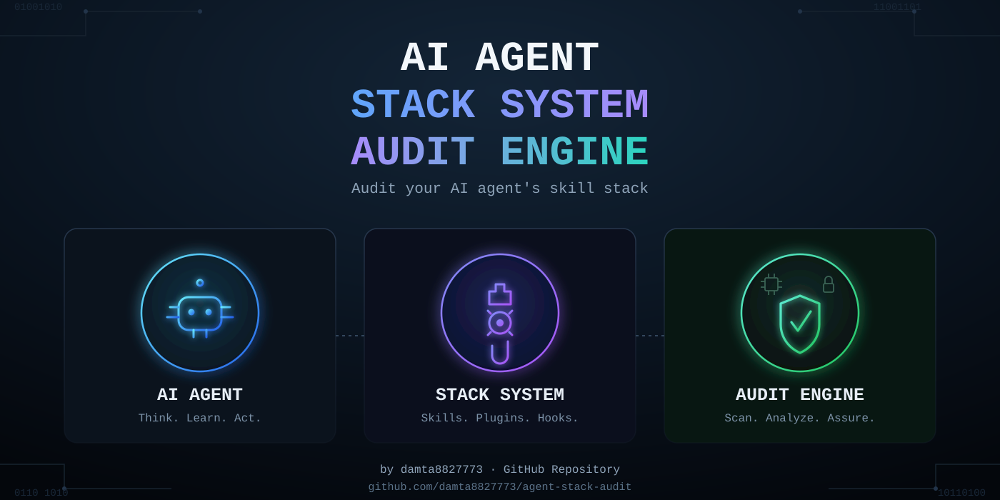
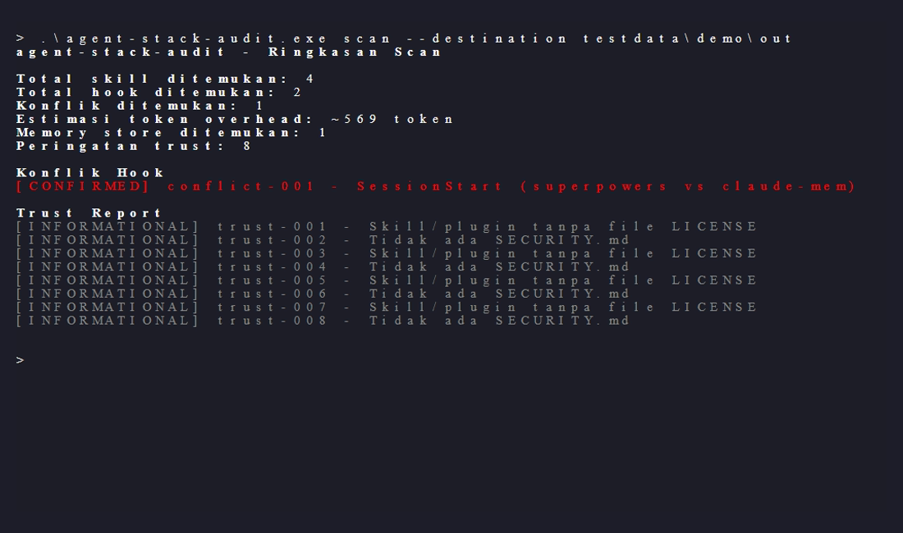
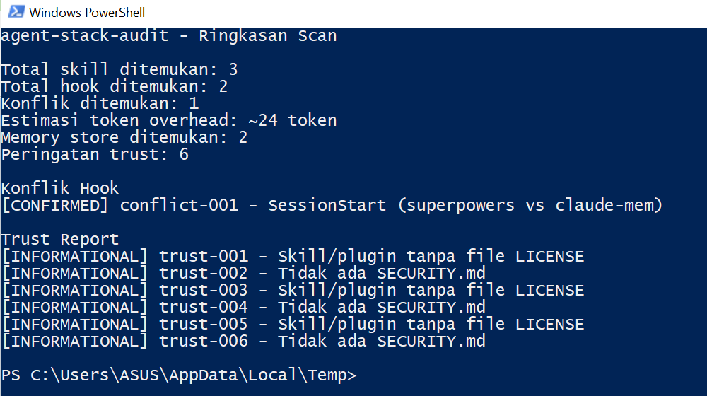
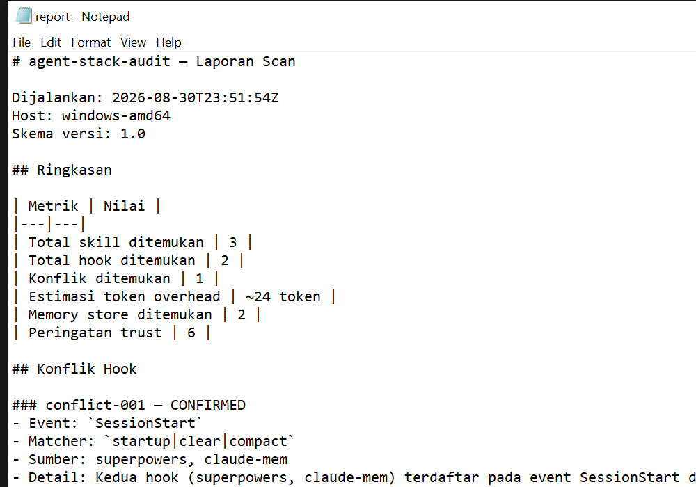

# agent-stack-audit



CLI read-only yang mengaudit skill, plugin, dan hook Claude Code - dan
mendeteksi konflik sebelum kamu sadar sendiri.

[](https://github.com/damta8827773/agent-stack-audit/actions/workflows/ci.yml)
[](LICENSE)


## The problem

Pasang lebih dari satu skill system Claude Code sekaligus (ECC, superpowers,
gstack, claude-mem, dst.) dan masing-masing bisa mendaftarkan skill
always-on - dimuat penuh ke context window di setiap sesi, entah kamu pakai
atau tidak, dan hook dari sumber berbeda bisa terdaftar di event yang sama
tanpa urutan eksekusi yang terjamin. Di mesin penulis sendiri, satu skill
always-on saja (`graphify`) sudah menyumbang lebih dari 10.000 token
overhead per sesi - angka nyata, bukan ilustrasi:

```
$ agent-stack-audit scan
agent-stack-audit - Ringkasan Scan

Total skill ditemukan: 5
Total hook ditemukan: 0
Konflik ditemukan: 0
Estimasi token overhead: ~10655 token
Memory store ditemukan: 2
Peringatan trust: 8
```

## Quick start

```
go install github.com/damta8827773/agent-stack-audit/cmd/agent-stack-audit@latest
agent-stack-audit scan
```



`scan` writes `report.md` and `report.json` to `./audit-report/` and prints
the summary above to the terminal. Colors render if your terminal supports
them (auto-detected - degrades to plain text otherwise, as shown here).

## What it checks

| Module | What it does |
|---|---|
| `discover` | Finds every skill, plugin, and hook registered under `~/.claude` (and project-level `.claude/`) |
| `conflict-check` | Flags hooks from different sources registered on the same event with an overlapping matcher |
| `token-cost` | Estimates context-window overhead from always-on skill instructions |
| `memory-audit` | Reports metadata (path, size, last-write time, permission) for known local memory stores - never their content |
| `trust-report` | Flags missing LICENSE/SECURITY.md, world-writable skill dirs, hooks calling external URLs or raw IP addresses, undocumented executable scripts, generic/buzzword-heavy skill descriptions |

A real `conflict-check` finding, reproducing an actual conflict found during
this project's own research (claude-mem and superpowers both register
`SessionStart` with the identical matcher `startup|clear|compact`):



Every finding carries a confidence level - `CONFIRMED`, `LIKELY`, or
`INFORMATIONAL` - so you know how much to trust it before acting:

| Level | Meaning |
|---|---|
| `CONFIRMED` | Exact match (identical matcher, world-writable permission bit) |
| `LIKELY` | Heuristic with real false-positive risk (partial matcher overlap, a hook calling an external domain) |
| `INFORMATIONAL` | Not a risk, just context (no LICENSE file, multiple hooks on the same event with no overlap) |

## What this does NOT do

*(copied verbatim from [docs/LIMITATIONS.md](docs/LIMITATIONS.md) - keep both in sync)*

### conflict-check is pattern matching, not static analysis

Conflicts are detected by splitting each hook's `matcher` string on `|` and
comparing the resulting sets across sources on the same event. This catches
identical and overlapping tool-name matchers (the common real-world case -
e.g. `Write|Edit|MultiEdit` vs `Write|Edit|MultiEdit|NotebookEdit`). It does
**not** understand full regex semantics beyond simple alternation, and it
never inspects what a hook's command actually does. Two hooks registered on
non-overlapping matchers can still race or interfere with each other through
side effects (shared files, shared state) that this tool has no way to see.
Treat CONFIRMED and LIKELY findings as "worth a manual look," not as a
complete list of every possible conflict.

### token-cost is a rough approximation

Token counts use a flat ~4 characters/token ratio
(`estimation_method: "char_ratio_approximate"` in every `token_cost` entry),
not the real tokenizer. Actual token counts vary by content - code,
non-English text, and heavy markdown formatting all shift the real ratio.
gstack's own `gstack-context-bill` calibrates per-content-type divisors
against real `count_tokens` measurements; agent-stack-audit v0.1 doesn't, by
choice - a single documented approximation is more honest than an
uncalibrated attempt at precision. An `--exact` flag that calls the real
`count_tokens` API is on the roadmap, gated behind an explicit egress
warning since it sends file text off the machine.

### World-writable / world-readable checks don't work on Windows

Go synthesizes Unix-style permission bits on Windows in a way that doesn't
reflect real ACL-based access control - every ordinary directory reads back
as if group/other could write to it. Rather than emit a false CONFIRMED
finding, `trust-report`'s world-writable check and `memory-audit`'s
world-readable check are both **skipped entirely on Windows** (they always
report `false`). On Linux and macOS these checks use real POSIX permission
bits and are meaningful.

### Scan depth is capped at 3 levels below each root

`discover` reads directory contents from the scan root down through 3
levels below it (deep enough to reach
`plugins/marketplaces/<vendor>/.claude-plugin/plugin.json`, which is exactly
3 levels below the `plugins/` root). A marketplace layout with an extra
nesting level (e.g. a vendor hosting multiple named plugins in their own
subdirectories) can put a manifest out of reach. This is a deliberate
depth cap, not a bug - unbounded recursion into arbitrary config trees is a
DoS/symlink-loop risk this tool won't take on.

### source_system is inferred, not authoritative

There's no standard field in SKILL.md frontmatter or a hook's matcher entry
that names the parent project. agent-stack-audit infers it, in order of
confidence: (1) a plugin manifest's own `name` field, (2) a small built-in
list of known name prefixes (`ecc-`, `gstack-`, `superpowers`,
`claude-mem`, `watermarks-remover`, `graphify`) matched against the
directory name or hook command string, (3) the literal directory name as a
fallback, or `"unknown"` for a hook whose command references only
`${CLAUDE_PLUGIN_ROOT}` with no other identifying text. A `source_system`
value in the report is a best-effort label, not a verified claim of
ownership.

### v0.1 only scans Claude Code

Codex, Cursor, Gemini CLI, and OpenCode are roadmap items (v0.3+), not
implemented. `CLAUDE_CONFIG_DIR` and `CLAUDE_MEM_DATA_DIR` overrides are
honored, but every other platform-specific location in Lampiran A's
"Roadmap v0.3" rows is not scanned yet - including the mirrored skill
directories that some tools (ECC, gstack) already write to those platforms
today. Scanning those in a future version risks double-counting the same
logical install if both the Claude Code and the mirrored copy get counted
separately; that needs its own dedup design, not a naive path addition.

### memory-audit's SQLite schema read is best-effort

Table names and row counts are read via a read-only connection when a
target file has a `.db` extension. A locked file, a non-SQLite file with a
`.db` extension, or a corrupt database simply produces no `tables` data -
this is never treated as an error, since the metadata (path/size/mtime/
permission) is the part of the contract that's guaranteed, not the schema
enrichment.

### Excludes are exact-path or prefix matches only

`.agent-stack-audit.yml`'s `exclude` list matches an entry's path exactly or
as a path prefix. There's no glob/wildcard support in v0.1 - `skills/foo-*`
won't work, you'd need to list each directory.

### The generic-description check is not AI-content detection

`trust-report` flags a skill/plugin description that leans on generic
marketing vocabulary (the same forbidden-word list this project's own docs
follow, plus a couple of well-known clichés - see
`genericMarketingPhrases` in `internal/trustreport/trustreport.go`). This is
always `INFORMATIONAL`, never higher, and deliberately so: there is no
reliable way to tell whether text was AI-written from surface features
alone, and this tool does not claim otherwise. It flags buzzword-heavy
copy, nothing more - a human can write "seamlessly supercharge your
workflow" and a language model can write plain, specific prose. Don't
read a finding here as an accusation about who or what wrote a skill.

### IP-literal hook calls are a weaker signal than they sound

`trust-report` gives a hook command that calls a raw IP address (IPv4 or
bracketed IPv6) a more specific message than a plain domain call, since
bypassing DNS is a pattern more associated with C2/exfiltration endpoints.
It is still `LIKELY`, not `CONFIRMED` - plenty of legitimate local tooling
calls `http://127.0.0.1:PORT` or a LAN device's IP directly. Review the
actual command before treating this as a real finding.

## Comparison

agent-stack-audit generalizes ideas from gstack's own audit tooling to work
across every skill system on the machine, not just gstack's own:

| | Scope | Cross-vendor? |
|---|---|---|
| `gstack-context-bill` | Token-cost audit of gstack's own skill tree | No - its own docstring describes it as "a STRIPPED port... parser tiers only understand the fork's dispatcher-skill layout" |
| `gstack-egress` | Hash-chained ledger of data gstack itself sends off the machine | No - only receipts gstack-initiated sends |
| `agent-stack-audit` | Token cost, hook conflicts, memory metadata, and trust findings across **every** installed skill system | Yes - that's the entire point |

This isn't a claim that agent-stack-audit is a strictly better tool -
`gstack-context-bill`'s per-content-type divisors are more precise than
this project's flat char-ratio estimate for gstack's own skills
specifically. It's a different, narrower job done well versus a broader,
cruder one done across everything installed.

## Configuration

Optional `.agent-stack-audit.yml` in the working directory (generate a
starting point with `agent-stack-audit init-config`):

```yaml
scan_paths:
  extra:
    - ~/custom-agent-config
exclude:
  - ~/.claude/skills/my-private-skill
output:
  format: [markdown, json]
  destination: ./audit-report
thresholds:
  token_overhead_warning: 10000
```

- `scan_paths.extra` - additional directories to walk, on top of the built-in defaults.
- `exclude` - paths to drop from the results (exact path or prefix match - see [Limitations](#what-this-does-not-do)).
- `output.destination` - where `report.md`/`report.json` get written.
- `thresholds.token_overhead_warning` - informational threshold for future TUI/CI-gate use.

`CLAUDE_CONFIG_DIR` and `CLAUDE_MEM_DATA_DIR` environment variables are
honored automatically for the base scan locations - no config needed for
that. See [docs/ARCHITECTURE.md](docs/ARCHITECTURE.md) for the full default
location list.

A sample of the generated `report.md`:



## Prior art

None of this is built in a vacuum. Nine projects shaped the design directly:

| Project | What it contributed |
|---|---|
| [mukul975/Anthropic-Cybersecurity-Skills](https://github.com/mukul975/Anthropic-Cybersecurity-Skills) | Structured skill layout with YAML frontmatter - reference for the confidence-level scheme |
| [tashfeenahmed/freellmapi](https://github.com/tashfeenahmed/freellmapi) | CLI + local dashboard pattern |
| [obra/superpowers](https://github.com/obra/superpowers) | Staged workflow with real approval checkpoints - the pattern this spec's own phase structure follows; also one half of the real CONFIRMED conflict fixture used in this repo's own tests |
| [mattpocock/skills](https://github.com/mattpocock/skills) | Two install paths (managed plugin vs. copy-editable) |
| [affaan-m/ECC](https://github.com/affaan-m/ECC) | Most complex of the nine - AgentShield config scanner, Memory Vault, 8-9 harnesses supported; the main case study for what a serious multi-tool install looks like |
| [guillaumemeyer/watermarks-remover](https://github.com/guillaumemeyer/watermarks-remover) | `check` vs `clean` hook mode - direct reference for defaulting to read-only |
| [Graphify-Labs/graphify](https://github.com/Graphify-Labs/graphify) | Confidence-labeling pattern for findings |
| [thedotmack/claude-mem](https://github.com/thedotmack/claude-mem) | SQLite + Chroma memory architecture - the primary `memory-audit` target; also the other half of the real CONFIRMED conflict fixture |
| [garrytan/gstack](https://github.com/garrytan/gstack) | `gstack-context-bill` and `gstack-egress` - the direct inspiration for `token-cost`, generalized to work across every skill system instead of just gstack's own (see [Comparison](#comparison)) |

## Contributing

See [CONTRIBUTING.md](CONTRIBUTING.md).

## License

MIT - see [LICENSE](LICENSE).
