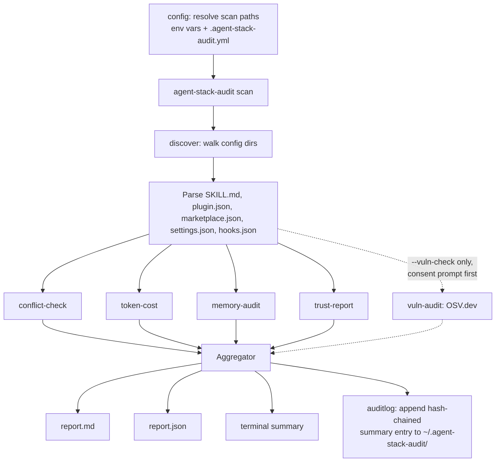

# Architecture

## Flow



`agent-stack-audit verify-log` and `agent-stack-audit diff` are separate
commands that only read `auditlog`'s file back - they don't re-run any
scan.

`config` is the only package that knows about `CLAUDE_CONFIG_DIR` and
`CLAUDE_MEM_DATA_DIR` environment variable overrides and the optional
`.agent-stack-audit.yml`. Every other module receives plain paths or
already-parsed entries - none of them reach into the environment directly.

## Package layout

```
cmd/agent-stack-audit/   orchestration: wires every module together, CLI flags, exit codes
internal/config/         scan-path resolution (env vars + yaml), MemoryTarget list
internal/discover/       walks config dirs, parses SKILL.md/plugin.json/marketplace.json/settings.json/hooks.json
internal/conflict/       hook event+matcher overlap detection (CONFIRMED/LIKELY/INFORMATIONAL)
internal/tokencost/      char-ratio token estimate for always-on skills
internal/memoryaudit/    metadata-only report on known memory stores, schema-only SQLite read
internal/trustreport/    LICENSE/SECURITY.md presence, world-writable dirs, network-calling hooks, undocumented scripts
internal/vulnaudit/      go.mod/package.json/requirements.txt manifest parsing + OSV.dev query (opt-in, --vuln-check)
internal/fix/            CONFIRMED-conflict suggestions for --fix; never edits another tool's files
internal/auditlog/       append-only, SHA-256 hash-chained scan history (~/.agent-stack-audit/); verify-log/diff read it back
internal/report/         DTOs matching report.json's schema, aggregator, JSON writer, Markdown writer
internal/tui/            lipgloss terminal summary render
internal/version/        single Version constant
```

## Module contracts

Each module takes the previous stage's output and returns its own typed
result - no module reaches past its own dependency to re-derive data
another module already computed. `discover.SkillEntry` is the shared
currency between `discover` and everything downstream of it
(`conflict-check`, `token-cost`, `trust-report` all consume
`[]discover.SkillEntry` directly); `memory-audit` is the one module that
doesn't depend on `discover` at all - it works off `config.MemoryTargets()`
independently, since memory stores aren't skill/plugin/hook artifacts.

`internal/report` is the only package that imports all five modules' output
types - by design, so a module never needs to know about the shared
`report.json` shape, only its own domain type.

### Deliberate extensions beyond the original interface sketch

Two things needed to grow beyond the smallest possible contract to actually
work against real installs, found during FASE 0 research and during
implementation:

- `discover.SkillEntry` carries `Event`/`Matcher`/`Command` fields (used
  only when `Type == "hook"`) - `conflict-check` needs them and there's
  nowhere else for them to live without a parallel type.
- `discover` scans `hooks.json` files, not just `settings.json`. Real
  installs (claude-mem, superpowers, watermarks-remover) register their
  hooks in their own plugin-local `hooks.json`, not merged into the user's
  `settings.json` - confirmed by reading raw source during FASE 0. A
  scanner that only reads `settings.json` would miss real, verified
  conflicts (see `internal/discover/discover_test.go`'s
  `TestScan_RealConfirmedConflict`, which reproduces the actual claude-mem
  vs. superpowers `SessionStart` conflict found during that research).

See [docs/LIMITATIONS.md](LIMITATIONS.md) for what these modules
deliberately don't attempt.

## Standards alignment

This is a one-person project, not a certified product - nothing here is an
ISO 27001 certification or a claim of formal compliance (that's an
organizational audit process, not something open source software can
claim for itself). What follows is honest: which NIST Cybersecurity
Framework 2.0 function each module's behavior lines up with.

| NIST CSF function | agent-stack-audit module |
|---|---|
| Identify | `discover` - identifies installed assets (skills/plugins/hooks) |
| Protect | `trust-report` - permission checks, LICENSE/SECURITY.md presence |
| Detect | `conflict-check`, `vuln-audit` - overlapping hooks, known CVEs |
| Respond | Reports + manual suggestions (`--fix`); no auto-response in v0.1 |
| Recover | `internal/auditlog` - append-only, hash-chained scan history; `verify-log` detects a tampered/deleted entry, `diff` shows what changed since the last scan. Detection, not prevention - see [docs/SECURITY_MODEL.md](SECURITY_MODEL.md) |

Also followed, and actually verifiable (unlike a certification claim):
[SPDX License Identifiers](https://spdx.dev/) on every `.go` file,
[Semantic Versioning 2.0.0](https://semver.org/), [Keep a Changelog 1.1.0](https://keepachangelog.com/en/1.1.0/),
[Conventional Commits 1.0.0](https://www.conventionalcommits.org/), and the
[OWASP CLI Security Cheat Sheet](https://cheatsheetseries.owasp.org/cheatsheets/Command_Line_Cheat_Sheet.html)'s
core principles (least privilege - read-only by default; no default
credentials; path validation during directory walks).
